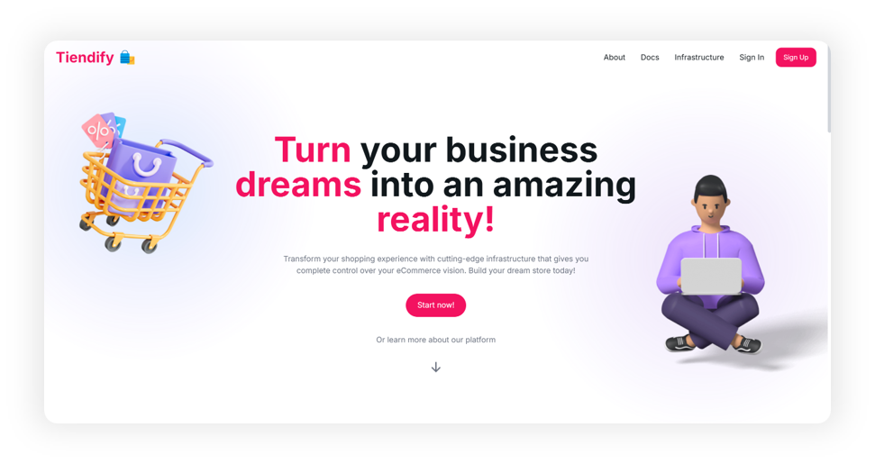

# Tiendify

  

Developed by:

- [Jose Gómez](https://github.com/josegomez)
- [Daniel Lujan](https://github.com/daniel-lujan)

## Description

This project is a web application that allows users to manage their e-commerce stores. The core functionality is self provisioning of e-commerce cloud services, such as hosting, databases, and storage. The application provides a dashboard where users can see the status of their stores, manage their products, API keys, and customers data.

## Technologies

### Frontend

        

### Backend

       

### Database

  

### Cloud & Deployment

    

## Learning objectives

The project aims to develop a web application for administration. The application will allow users to manage transactions and movements, as well as manage users with different roles. The web will be built using technologies such as NextJS, React, and TailwindCSS, and will be integrated with a database.
